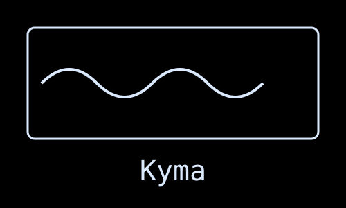
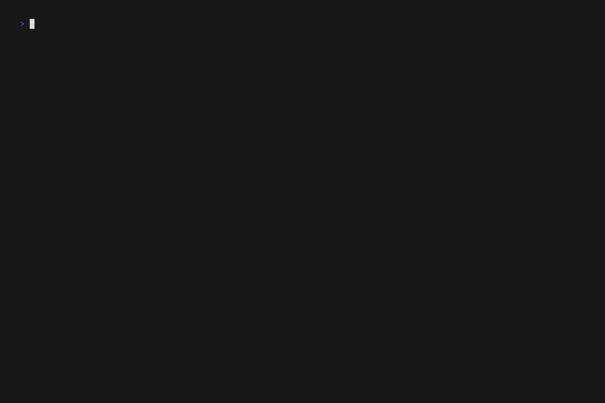

<div align="center">
  
</div>

&nbsp;

> **Κῦμα** (Kyma) - _Ancient Greek_: A wave, billow, or surge; metaphorically representing the flow and movement of ideas and presentations.

A terminal-based presentation tool that creates beautiful presentations from markdown files with smooth animated transitions.

<div align="center">
  
</div>
&nbsp;
<div align="center">
  
  <br>
  <em>Kyma being used for a <a href="https://www.youtube.com/live/_R_sACr74bI?si=LYM9sJ1vuItUO3cm&t=259">talk</a> at Laravel Greece's 10 year anniversary meetup in Athens</em>
</div>
&nbsp;


<div align="center">
  
  
  
  
</div>


## Features

- **Markdown-based**: Write your presentations in simple markdown syntax
- **Rich rendering**: Beautiful terminal rendering using Glamour markdown renderer
- **Smooth transitions**: Multiple animated transition effects between slides
  - Swipe left/right
  - Slide up/down
  - Flip effects
  - Collapse and expand
  - Fade in/out
- **Hot reload**: Live reloading of presentation files during editing by default
- **Customizable styling**: Configure borders, colors, and layouts via YAML front matter
- **Theme support**: Choose from built-in Glamour themes or load custom JSON theme files
- **Flexible layouts**: Center, align, and position content with various layout options
- **Grid layouts**: Split a slide into rows and columns with `[grid]`, `[row]` and `[col]`
  - Proportional `span`, exact `width`/`height`, or percentages
  - Per-container `align`, `valign`, `gap`, `pad` and `border`
  - Nest grids to build tiling master/stack layouts
- **Master layouts**: Define a reusable layout once under `masters:` and fill its `[slot]`s from each slide
- **Simple navigation**: Intuitive keyboard controls for presentation flow (vim style btw)
  - Command palette with slide search and filtering
  - Direct slide jumping by number
  - Multi-slide forward/backward jumping
  - Quick first/last slide navigation
- **Presentation timer**: Built-in timer system with per-slide and global timing
  - Toggle timer display with a single key
  - Track time spent on each slide
  - Monitor total presentation duration
  - Automatic pause/resume during slide transitions

## Installation

### Using Go

```bash
go install github.com/museslabs/kyma@latest
```

### From Source

```bash
git clone https://github.com/museslabs/kyma.git
cd kyma
go build -o kyma
```

## Usage

> run `kyma docs` for an interactive presentation of the documentation

### Basic Usage

```bash
# Display a presentation
kyma presentation.md

# Display a presentation without hot reloading
kyma presentation.md -s

# Show version
kyma version
```

### Navigation

- **Next slide**: `→`, `l`, or `Space`
- **Previous slide**: `←` or `h`
- **First slide**: `Home`, `Shift+↑`, or `0`
- **Last slide**: `End`, `Shift+↓`, or `$`
- **Command palette**: `/` or `p` - Opens a searchable list of all slides for quick navigation
- **Go to slide**: `g` or `:` - Jump directly to a specific slide number
- **Jump slides**: `1-9` + `h`/`←` or `l`/`→` - Jump multiple slides backward/forward (e.g., `5h` jumps 5 slides back)
- **Toggle timer**: `t` - Shows/hides the timer display with total and per-slide timing
- **Quit**: `q`, `Esc`, or `Ctrl+C`

## Configuration

Kyma presentations use a simple format with slides separated by `----` and optional YAML front matter for configuration.

### Presentation Format

```markdown
# First Slide

This is the content of the first slide

----

---
transition: swipeLeft
---

# Second Slide

This slide will appear with a swipe left transition

----

---
transition: slideUp
style:
border: rounded
border_color: "#9999CC"
layout: center
theme: dracula
---

# Third Slide

This slide has custom styling with Dracula theme

----

---
style:
theme: /path/to/custom-theme.json
---

# Fourth Slide

This slide uses a custom JSON theme file

----

# Image with 20x10 size


```

### Available Transitions

- `none` - No transition (default)
- `swipeLeft` - Slide swipes in from right to left
- `swipeRight` - Slide swipes in from left to right
- `slideUp` - Slide slides up from bottom
- `slideDown` - Slide slides down from top
- `flip` - Flip transition effect
- `collapse` - Collapse transition effect
- `expand` - Expand transition effect
- `fade` - Fade transition effect

### Style Configuration

You can customize each slide's appearance using the style configuration:

```yaml
style:
  border: rounded # Border style: normal, rounded, double, thick, hidden, block
  border_color: "#FF0000" # Hex color for border (or "default" for theme-based color)
  layout: center # Layout positioning: center, left, right, top, bottom
  theme: dracula # Theme name or path to custom JSON theme file
```

Layout can also be specified as a combination: `layout: center,right`

### Grid Layouts

Split a slide into columns with `[row]` and `[col]`:

```markdown
[row]
[col]
## Left
[/col]
[col]
## Right
[/col]
[/row]
```

Wrap rows in a `[grid]` to stack them vertically. Columns written straight
inside a `[grid]` share one implicit row, and content written straight inside a
`[row]` gets an implicit column, so `[row]one line[/row]` is a complete row.

An opening tag has to be the first thing on its line, which is what keeps
`[grid]` in the middle of a sentence from being treated as markup. Closing tags
may end a line. Tags inside a fenced code block are never interpreted.

#### Sizing

| Attribute | Applies to | Meaning |
| --- | --- | --- |
| `span=N` | `col`, `row` | Share of the axis. A `span=2` column is twice as wide as a `span=1` sibling. |
| `width=N`, `width=N%` | `col` | An exact width in cells, or a percentage of the row. |
| `height=N`, `height=N%` | `row`, `grid` | An exact height in lines, or a percentage of the slide. |

Columns split their row evenly by default. Rows are as tall as their content
until one asks for a share of the slide with `span` or an exact `height`.

#### Presentation

| Attribute | Meaning |
| --- | --- |
| `align` | `left`, `center` or `right` |
| `valign` | `top`, `middle` or `bottom` |
| `gap=N` | Cells left between children. A grid's gap carries over to its rows. |
| `pad=N`, `pad="V H"` | Padding inside the container, CSS-style. |
| `border` | Any border name a slide's `style.border` accepts, or `none`. |
| `border_color` | Border colour, e.g. `"#9999CC"`. |

#### Master/stack layouts

Nesting a grid inside a column gives you the tiling layout window managers use:
one wide column beside a stack.

```markdown
[grid gap=1]
[col span=2]
## Master
[/col]
[col]
[row]stack one[/row]
[row]stack two[/row]
[/col]
[/grid]
```

### Master Layouts

Rather than repeating the same grid on every slide, define it once under
`masters:` in your config file and leave holes for the content:

```yaml
masters:
  two-col: |
    [row gap=2]
    [col span=2]
    [slot content]
    [/col]
    [col]
    [slot side]
    [/col]
    [/row]
```

A slide then picks the layout and fills it:

```markdown
---
master: two-col
---

# Headline

The body of the slide.

[slot side]
- a note
- another
[/slot]
```

Anything written outside a `[slot]` fills the `content` slot, so a slide that
only needs the main hole can be plain markdown. A `[slot]` the slide leaves
unfilled keeps whatever default content the layout wrote inside it.

`master:` also accepts a path to a markdown file, which is handy for keeping
layouts next to the presentation:

```markdown
---
master: ./layouts/two-col.md
---
```

Set `global.master` (or a preset's `master`) to apply one to a whole deck.

> The key is `master:`, not `layout:`. `layout:` already means content
> alignment within the slide.

### Timer Display

The timer display shows two timing metrics:

- **Total**: The total duration of the presentation
- **Slide**: The time spent on the current slide

The timer display appears as an overlay in the top-left corner of the screen when toggled with the `t` key. The timer automatically:

- Starts when the presentation begins
- Pauses when switching slides
- Resumes when a new slide is displayed
- Maintains separate timing for each slide
- Preserves timing state during navigation

### Global Configuration

Kyma supports a global configuration file that can be used to set default styles and create named presets. The configuration file can be placed in either:

- The current directory as `kyma.yaml`
- The user's config directory as `~/.config/kyma.yaml`

You can also specify a custom config file path using the `-c` or `--config` flag:

```bash
kyma -c /path/to/config.yaml presentation.md
```

The configuration file follows this structure:

```yaml
global:
  style:
    border: rounded
    border_color: "#9999CC"
    layout: center
    theme: dracula

presets:
  minimal:
    style:
      border: hidden
      theme: notty
  dark:
    style:
      border: rounded
      theme: dracula

masters:
  two-col: |
    [row gap=2]
    [col]
    [slot content]
    [/col]
    [col]
    [slot side]
    [/col]
    [/row]
```

You can use presets in your slides by specifying the preset name:

```yaml
---
preset: minimal
---
# This slide uses the minimal preset
```

Configuration precedence (from highest to lowest):

1. Named preset configuration
2. Slide-specific configuration
3. Global configuration

### Theme Support

Kyma supports both built-in Glamour themes and custom JSON theme files:

#### Built-in Themes

- `ascii` - ASCII-only styling
- `auto` - Automatically detected theme
- `dark` - Dark theme (default)
- `dracula` - Dracula color scheme
- `tokyo-night` (or `tokyonight`) - Tokyo Night theme
- `light` - Light theme
- `notty` - Plain text styling
- `pink` - Pink color scheme

#### Custom JSON Themes

You can create custom themes by providing a path to a JSON file that follows the Glamour `StyleConfig` format. If the theme name doesn't match a built-in theme, Kyma will attempt to load it as a JSON file:

```yaml
style:
  theme: ./themes/my-custom-theme.json
```

The border color will automatically adapt to use the theme's H1 background color unless explicitly overridden with `border_color`.o

For more info on how to create custom styles, you can refer to [Glamour's](https://github.com/charmbracelet/glamour/tree/master/styles) documentation.

## Contributing

All contributions are welcome! If you're planning a significant change or you're unsure about an idea, please open an issue first so we can discuss it in detail.

### Development

1. Fork the repository
2. Create your feature branch (`git checkout -b feature/amazing-feature`)
3. Commit your changes (`git commit -m 'Add some amazing feature'`)
4. Push to the branch (`git push origin feature/amazing-feature`)
5. Open a Pull Request

## Acknowledgements

- [Charm](https://charm.sh/) for their amazing TUI libraries:
  - [Bubble Tea](https://github.com/charmbracelet/bubbletea) - Terminal UI framework
  - [Glamour](https://github.com/charmbracelet/glamour) - Markdown rendering
  - [Lipgloss](https://github.com/charmbracelet/lipgloss) - Style definitions
  - [Harmonica](https://github.com/charmbracelet/harmonica) - Smooth animations
- [Cobra](https://github.com/spf13/cobra) for CLI interface
- [fsnotify](https://github.com/fsnotify/fsnotify) for file watching capabilities
- [chafa-go](https://github.com/ploMP4/chafa-go) for rendering images

## Roadmap

- ~~Add support for more style options like text color and background color~~ ✅ **Done!**
- ~~Allow choosing from any glamour themes~~ ✅ **Done!**
- ~~Support for custom JSON theme files~~ ✅ **Done!**
- ~~Add more transition effects~~ ✅ **Done!**
- ~~Create grid-based slide layouts~~ ✅ **Done!**
- ~~Reusable master layouts with content slots~~ ✅ **Done!**
- ~~Support image rendering in terminals (e.g., via the Kitty protocol)~~ ✅ **Done!**
