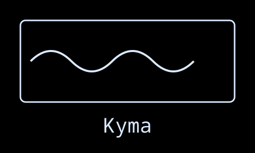
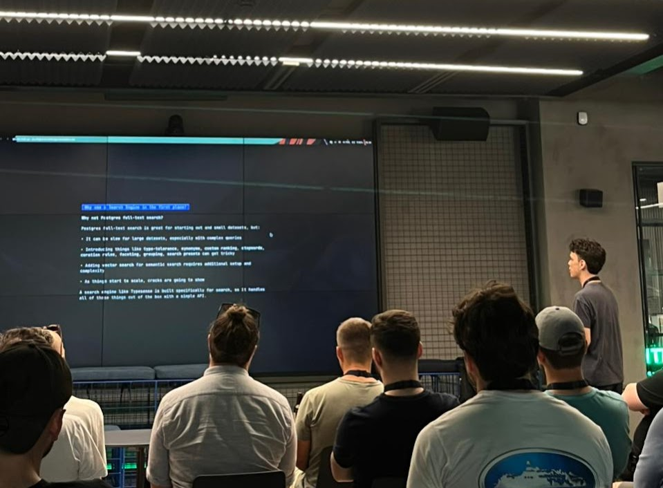

> Κῦμα (Kyma) - Ancient Greek: A wave, billow, or surge; metaphorically
representing the flow and movement of ideas and presentations.

A terminal-based presentation tool that creates beautiful presentations from
markdown files with smooth animated transitions.

## Basic navigation:

- **Next slide**: `→`, `l`, or `Space`
- **Previous slide**: `←` or `h`
- **Quit**: `q`, `Esc`, or `Ctrl+C`

----
---
title: Features
transition: swipeLeft
style:
  border: hidden
  theme: dracula
---

# Features

- **Markdown-based**: Write your presentations in simple markdown syntax
- **Rich rendering**: Beautiful terminal rendering using Glamour markdown renderer
- **Smooth transitions**: Multiple animated transition effects between slides
- **Image Rendering**: Render high quality images
- **Hot reload**: Live reloading of presentation files during editing by default
- **Customizable styling**: Configure borders, colors, and layouts via YAML
- **Theme support**: Choose from built-in Glamour themes or load custom JSON theme
- **Flexible layouts**: Center, align, and position content with various layouts
- **Simple navigation**: Intuitive keyboard controls for presentation flow
  - Command palette with slide search and filtering
  - Direct slide jumping by number
  - Multi-slide forward/backward jumping
  - Quick first/last slide navigation
- **Presentation timer**: Built-in timer system with per-slide and global timing
  - Toggle timer display with a single key
  - Track time spent on each slide
  - Monitor total presentation duration
  - Automatic pause/resume during slide transitions

----
---
title: Transitions
transition: swipeLeft
style:
  border: hidden
  theme: dracula
---

# Available transitions

- `none` - No transition (default)
- `swipeLeft` - Slide swipes in from right to left
- `swipeRight` - Slide swipes in from left to right
- `slideUp` - Slide slides up from bottom
- `slideDown` - Slide slides down from top
- `flip` - Flip transition effect
- `collapse` - Collapse transition effect
- `expand` - Expand transition effect
- `fade` - Fade transition effect

----
---
title: Styles
transition: slideUp
style:
  border: rounded
  border_color: "#FF0000"
  layout: center
  theme: tokyo-night
---

# Styling and theme support

- `border` - normal, rounded, double, thick, hidden, block
- `border_color` - Hex color for border (or "default" for theme-based color)
- `layout` - center, left, right, top, bottom
- `theme` - predefined theme name or path to custom JSON theme file

----
---
title: Style usage
style:
  border: hidden
  theme: dracula
transition: swipeLeft
---

# Style usage

To use these styles you can do so by writing yaml at the top of each slide in
wrapped between three dashes `---`

```yaml
transition: swipeLeft
style:
  border: rounded
  border_color: "#FF0000"
  layout: center
  theme: dracula
```

----
---
title: Config
style:
  theme: dracula
---

# Configuration

A configuration file is created by default in `~/.config/kyma.yaml` but you
can use another config file using the `-c` flag or by having a `kyma.yaml`
file present in the directory you are executing the command from.

A `kyma.yaml` file looks like this:

```yaml
global:
  style:
    border: rounded
    border_color: "#9999CC"
    layout: center
    theme: dracula

presets:
  minimal:
    style:
      border: hidden
      theme: notty
  dark:
    style:
      border: rounded
      theme: dracula
```

----
---
title: Global styles
style:
  theme: dracula
---

# Global styles

You can define a global style config that all slides use if no configuration is
provided.

If we take a look at our `kyma.yaml` from before you can see the global
configuration in lines 1-6

```yaml{1-6} --numbered
global:
  style:
    border: rounded
    border_color: "#9999CC"
    layout: center
    theme: dracula

presets:
  minimal:
    style:
      border: hidden
      theme: notty
  dark:
    style:
      border: rounded
      theme: dracula
```

----
---
title: Presets
style:
  theme: dracula
---

# Presets

Presets are a way to define reusable style configurations to apply to individual
slides withou having to copy pase each time

If we take a look again at our `kyma.yaml` from before you can see the presets
in lines 8-16

```yaml{8-16} --numbered
global:
  style:
    border: rounded
    border_color: "#9999CC"
    layout: center
    theme: dracula

presets:
  minimal:
    style:
      border: hidden
      theme: notty
  dark:
    style:
      border: rounded
      theme: dracula
```

----
---
title: More ways to navigate
style:
  theme: dracula
---

# More ways to navigate

- **Last slide**: `End`, `Shift+↓`, or `$`
- **Command palette**: `/` or `p` - Opens a searchable list of all slides for quick navigation
- **Go to slide**: `g` or `:` - Jump directly to a specific slide number
- **Jump slides**: `1-9` + `h`/`←` or `l`/`→` - Jump multiple slides backward/forward (e.g., `5h` jumps 5 slides back)

----
---
title: Grid layouts
transition: swipeLeft
image_backend: docs
---

# Grid Layout

Split a slide with `[row]` and `[col]`. A row lays its columns out side by
side, and an unsized column takes an equal share of the width.

[row gap=2]
[col]
```go
package main

import "fmt"

func main() {
  fmt.Println("Hello World")
}
```
[/col]
[col]
```rust
fn main() {
  println!("Hello World");
}
```
[/col]
[/row]

A tag has to be the first thing on its line, so `[grid]` in the middle of a
sentence stays ordinary text. Closing tags may end a line, which is why
`[row]one line[/row]` works.

----
---
title: Sizing columns
transition: swipeLeft
image_backend: docs
---

# Sizing

`span` gives a column a share of the row, `width` gives it an exact number of
cells or a percentage. A `span=2` column next to a `span=1` one is the classic
two thirds / one third split.

[row gap=2]
[col span=2 border=rounded pad=1]
`span=2` — twice the width of its neighbour.
[/col]
[col border=rounded pad=1]
`span=1`
[/col]
[/row]

[row gap=2]
[col width=30% border=rounded pad=1]
`width=30%`
[/col]
[col border=rounded pad=1]
Whatever is left over.
[/col]
[/row]

----
---
title: Rows and nesting
transition: swipeLeft
image_backend: docs
---

# Master Layouts

Wrap rows in a `[grid]` to stack them, and nest a grid inside a column to split
it again. That is all a tiling master layout is: one wide column beside a stack.

[grid gap=1]
[col span=2 border=rounded pad=1]
## Master

The wide column, `span=2`.
[/col]
[col]
[row border=rounded pad="0 1"]stack one[/row]
[row border=rounded pad="0 1"]stack two[/row]
[/col]
[/grid]

Rows are as tall as their content until one asks for a share of the slide with
`span` or an exact `height`.

----
---
title: Layout attributes
transition: swipeLeft
image_backend: docs
---

# Attributes

Every container takes the same set:

[row gap=3]
[col]
- `span=N` — share of the axis
- `width=N`, `width=N%` — an exact column width
- `height=N`, `height=N%` — an exact row height
- `gap=N` — cells between children
[/col]
[col]
- `align` — `left`, `center`, `right`
- `valign` — `top`, `middle`, `bottom`
- `pad=N` or `pad="V H"`
- `border=rounded`, `border_color="#ff0000"`
[/col]
[/row]

Borders use the same names as a slide's own `style.border`.

----
---
title: Reusable layouts
transition: swipeLeft
image_backend: docs
---

# Reusable Layouts

Define a layout once and fill it per slide. In `kyma.yaml`:

```yaml
masters:
  two-col: |
    [row gap=2]
    [col span=2]
    [slot content]
    [/col]
    [col]
    [slot side]
    [/col]
    [/row]
```

----
---
title: Filling a layout
transition: swipeLeft
image_backend: docs
---

# Filling a Layout

A slide then only writes its content:

```markdown
---
master: two-col
---

# Headline

[slot side]
- a note
[/slot]
```

Anything outside a `[slot]` fills `content`. `master:` also takes a path to a
markdown file, and `global.master` applies one to the whole deck.

----
---
title: Achievements
transition: swipeLeft
image_backend: docs
style:
  theme: dracula
---

# Achievements

_Kyma being used for a talk at Laravel Greece's 10 year anniversary meetup in Athens_



