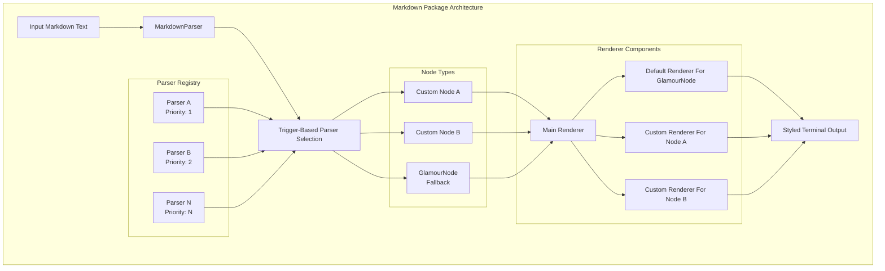

# Architecture

```mermaid
graph TB
    subgraph "Markdown Package Architecture"
        A[Input Markdown Text] --> B[MarkdownParser]
        
        subgraph "Parser Registry"
            C[Parser A<br/>Priority: 1]
            D[Parser B<br/>Priority: 2]
            E[Parser N<br/>Priority: N]
        end
        
        B --> F[Trigger-Based Parser Selection]
        C --> F
        D --> F
        E --> F
        
        subgraph "Node Types"
            G[Custom Node A]
            H[Custom Node B]
            I[GlamourNode<br/>Fallback]
        end
        
        F --> G
        F --> H
        F --> I
        
        subgraph "Renderer Components"
            J[Main Renderer]
            K[Default Renderer For GlamourNode]
            L[Custom Renderer For Node A]
            M[Custom Renderer For Node B]
        end
        
        G --> J
        H --> J
        I --> J
        
        J --> K
        J --> L
        J --> M
        
        N[Styled Terminal Output] 
        K --> N
        L --> N
        M --> N
    end
```
